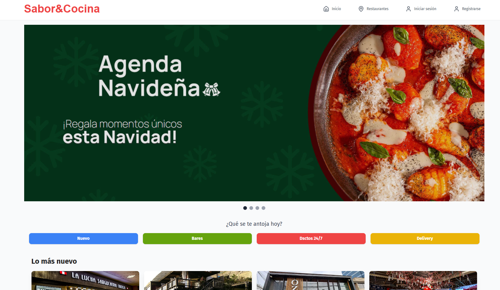

# Make It Real - Sabor&Mesa 🍽️

Sabor & Mesa is the perfect app for lovers of Peruvian cuisine. With our platform, you can easily reserve your table at the best restaurants in Peru, enjoying unique culinary experiences in real-time.

## Table of Contents

- [Overview](#overview)
  - [The Challenge](#the-challenge)
  - [Screenshot](#screenshot)
- [Installation](#installation)
- [Usage](#usage)
- [Built With](#built-with)
- [Authors](#authors)
- [Acknowledgments](#acknowledgments)

## Overview

### The Challenge

Users should be able to:

- **User registration and authentication**
- **Store information in a database**
- **Image upload**

### Screenshot

<div align="center">
  
</div>

## Built With

**Frontend:**

- Mobile-first workflow
- Tailwind CSS
- React with TypeScript

**Backend:**

- Node.js (Express) with TypeScript
- PostgreSQL for database management

**Operations:**

- Deployed on Vercel

## Installation

1. Clone the repository:
   ```sh
   git clone https://github.com/Victormrl17/frontend-sabor-mesa.git
   ```
2. Navigate to the project directory:
   ```sh
   cd frontend-sabor-mesa
   ```
3. Install dependencies:
   ```sh
   npm install
   ```

## Usage

1. Start the development server:
   ```sh
   npm start
   ```

## Author

Full stack Developer:

- Victor Ramirez - [@Victormrl17](https://github.com/Victormrl17) (https://www.linkedin.com/in/victor-ramirez-8049a4193/)

## Acknowledgments

A special thanks to Make it Real, especially [@khriztianmoreno](https://github.com/khriztianmoreno) for the valuable feedback during daily meetings and demos, and to [@nayruthCalla](https://github.com/nayruthCalla) for the support and review.
